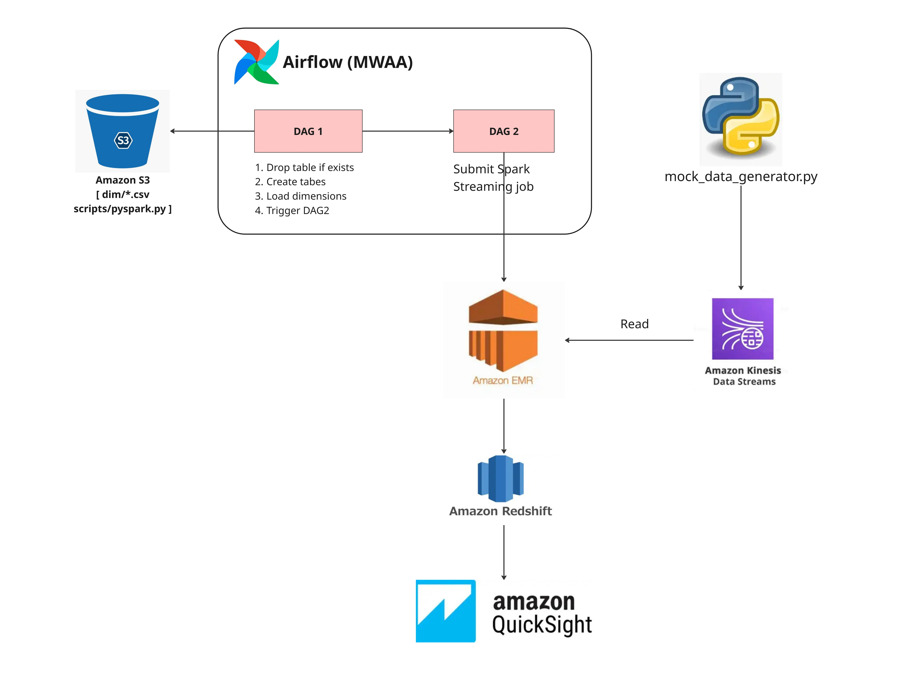
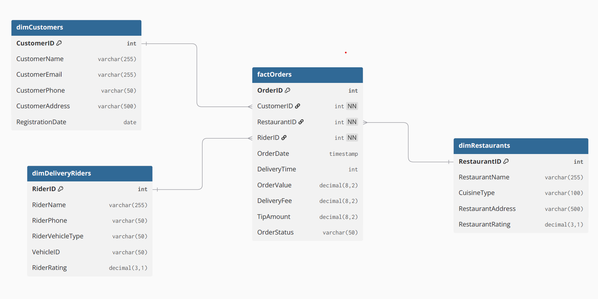
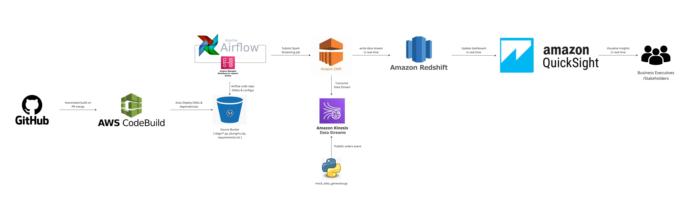
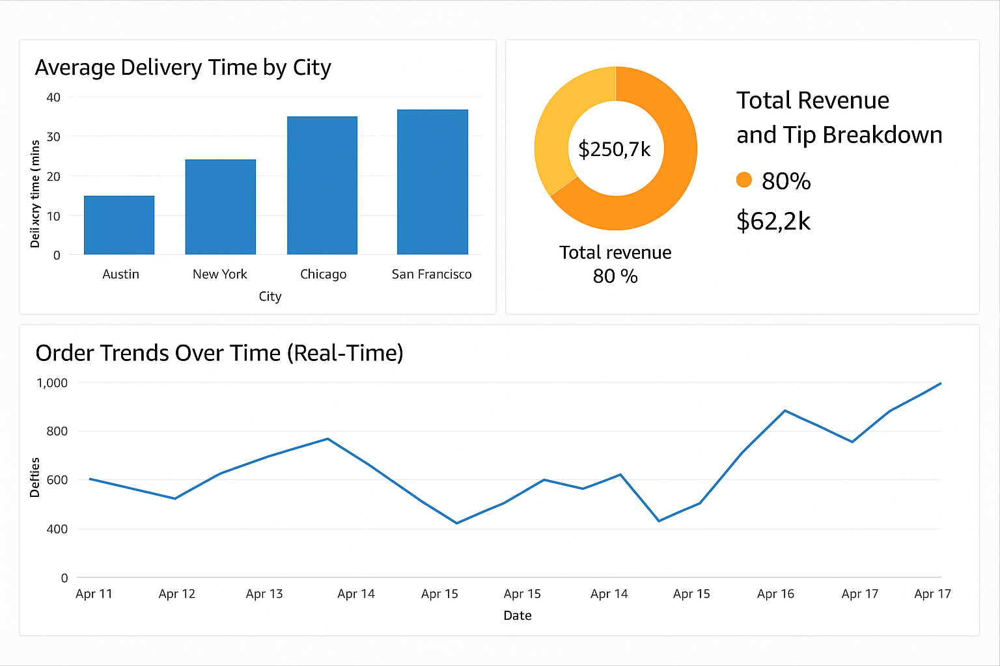

# Real-Time Streaming Pipeline on AWS

This real-time streaming pipeline project simulates a food delivery use case, processing continuous order events using a scalable, fully managed architecture built on AWS. It leverages AWS services including **Amazon Kinesis**, **Amazon EMR (PySpark Streaming)**, **Amazon Redshift**, **Amazon MWAA** (Managed Workflows for Apache Airflow), **Amazon QuickSight**, and **AWS CodeBuild**.

The pipeline demonstrates an end-to-end data engineering workflow — ingesting streaming data, transforming it in real time, storing it in a data warehouse, and visualizing key operational metrics. It delivers insights into **delivery performance**, **customer behavior**, and **real-time order trends**, showcasing production-grade streaming analytics on AWS.

---

## Data Architecture

---

## Objective

To design and implement a real-time streaming data pipeline focused on processing **food order events**, where:

- **Simulated food order data** is continuously published to an **Amazon Kinesis Data Stream**  
- A **PySpark Streaming job on Amazon EMR** consumes, processes, and enriches the data in real time  
- **Cleaned and deduplicated records** are written to a **fact table in Amazon Redshift**  
- **Dimension tables** are batch-loaded into Redshift from curated files in **Amazon S3**  
- Interactive **dashboards in Amazon QuickSight** visualize real-time order metrics and delivery insights  
- The **entire pipeline is orchestrated** using **Amazon MWAA (Managed Workflows for Apache Airflow)**

---

## Tech Stack

| Layer             | Tools / Services                             |
|------------------|-----------------------------------------------|
| Data Ingestion    | Amazon Kinesis Data Stream                    |
| Stream Processing | Amazon EMR with PySpark Structured Streaming |
| Orchestration     | Amazon Managed Workflows for Apache Airflow  |
| Data Warehouse    | Amazon Redshift                               |
| Storage           | Amazon S3                                     |
| Visualization     | Amazon QuickSight                             |
| CI/CD             | GitHub, AWS CodeBuild                         |

---

## Project Structure

📁 dags/

├── airflow_to_emr.py # Airflow DAG to trigger EMR PySpark job

└── dim_load_dag.py # Airflow DAG to create & load dimension tables

📁 data_for_dims/

├── dimCustomers.csv

├── dimRestaurants.csv

└── dimDeliveryRiders.csv # Static dimension data

📁 jars/

└── redshift-jdbc42-2.1.0.12.jar # Redshift JDBC connector for EMR

📁 scripts/

└── pyspark_streaming.py # PySpark Structured Streaming job

📄 mock_data_generator.py # Simulates customer order events → Kinesis

📄 dwh_create_table_commands.sql # Redshift DDL for schema & fact table

📄 buildspec.yml # AWS CodeBuild build config

📄 README.md # Project documentation

---

## Warehouse Data Model: Star Schema Structure

---

## Real-Time Data Pipeline Flow

1. **Simulated Order Events**  
   - `mock_data_generator.py` simulates food order events and continuously publishes them as JSON records into **Amazon Kinesis Data Streams**.

2. **Automated Build & Deployment**  
   - Code changes (Airflow DAGs/configs) pushed to **GitHub** trigger an **automated build in AWS CodeBuild** on pull request merges.  
   - Artifacts (DAGs, requirements, plugins) are deployed to an **S3 source bucket**.

3. **Orchestration with MWAA (Airflow)**  
   - **Amazon Managed Workflows for Apache Airflow (MWAA)** reads DAGs and dependencies from the S3 bucket.  
   - Airflow DAGs:
     - Create Redshift schema and dimension tables.
     - Load dimension data into Redshift from S3.
     - Submit **PySpark streaming job to Amazon EMR** using `EmrAddStepsOperator`.

4. **Stream Processing on Amazon EMR**  
   - The **PySpark job (`pyspark_streaming.py`)** on **Amazon EMR** consumes events from **Kinesis**, deduplicates, enriches, and writes them to the **Redshift `fact_orders` table** via JDBC.

5. **Data Storage in Amazon Redshift**  
   - Real-time fact data and batch-loaded dimensions are stored in **Amazon Redshift**, enabling fast analytics at scale.

6. **Visualization with Amazon QuickSight**  
   - **Amazon QuickSight** dashboards are connected to Redshift to deliver real-time insights to **business executives and stakeholders**.  
   - Example metrics include:
     - Order volume by city/cuisine  
     - Average delivery time by hour  
     - Trend analysis of tips vs delivery fee

---

## Sample Insights

These visualizations are generated from real-time and batch-processed data stored in Amazon Redshift and visualized using Amazon QuickSight:

- **Average Delivery Time by City**  
  A bar chart comparing average delivery durations across cities such as Austin, New York, Chicago, and San Francisco.

- **Total Revenue and Tip Breakdown**  
  A donut chart illustrating total revenue alongside the percentage and value of tips, offering financial visibility into order earnings.

- **Order Trends Over Time (Real-Time)**  
  A time series line chart displaying the number of orders per day, helping to track order volume trends and peak times.

---

## Getting Started

> ⚠️ **Note:** You will need access to an AWS account with permissions for **EMR, Kinesis, Redshift, S3, MWAA (Airflow)**, **IAM**, and **CodeBuild**.

---

### ✅ Prerequisites

Make sure you have the following:

- AWS CLI configured (`aws configure`) (Requires: Access Key and Secret Key — create a user in IAM → generate access keys under Security Credentials)
- IAM permissions to create/access:
  - S3 buckets
  - Redshift cluster
  - Kinesis Data Streams
  - EMR Cluster
  - MWAA Environment
  - QuickSight access
  - AWS CodeBuild
- Python 3.x installed locally (for order simulation)
- Git installed
- GitHub repository

---

### 1️⃣ Clone the Repository

- git clone https://github.com/yourusername/food-delivery-data-pipeline.git

- cd food-delivery-data-pipeline

---

### 2️⃣ Set Up AWS Infrastructure

#### Create S3 Buckets & Folder Structure

Create the following folder structure across the respective S3 buckets:

##### 🔹 `your-bucket1/` (used by **Amazon MWAA**)

- `dags/` → for Airflow DAGs  
- `plugins/` → for custom Airflow plugins  
- `requirements/` → for Python dependency files (`requirements.txt`)

##### 🔹 `your-bucket2/` (used by **EMR** & **Redshift**)

- `dims/` → for dimension CSV files (`dimCustomers.csv`, `dimRestaurants.csv`, etc.)  
- `pyspark_script/` → for PySpark streaming job script (`pyspark_streaming.py`)  
- `redshift-connector-jar/` → for Redshift JDBC driver (`redshift-jdbc42-xxx.jar`)

##### 🔹 `your-bucket3/` (used for **Spark Streaming Checkpointing**)

- `stream-checkpointing/kinesisToRedshift/` → to store Spark streaming checkpoint state

---

#### Set Up AWS CodeBuild + GitHub for CI/CD

- This project uses **AWS CodeBuild** to automate deployment of project files to S3.
- Connect CodeBuild with GitHub using a **Personal Access Token – Classic**  
  (with `repo`, `admin:repo_hook` scopes for access and webhook triggers).
- When a pull request is merged into the `main` branch:
  - CodeBuild is triggered via GitHub webhook
  - It uploads the following folders/files from the repository to your target S3 buckets:

    | Local Path                | S3 Destination                                   | Purpose                              |
    |---------------------------|--------------------------------------------------|--------------------------------------|
    | `dags/`                   | `s3://your-bucket1/dags/`                        | Airflow DAGs for MWAA                |
    | `dims/`                   | `s3://your-bucket2/dims/`                        | Dimension CSV files for Redshift     |
    | `pyspark_script/`         | `s3://your-bucket2/pyspark_script/`             | PySpark streaming job script         |
    | `redshift-connector-jar/` | `s3://your-bucket2/redshift-connector-jar/`     | Redshift JDBC connector JAR          |

✅ **No need to manually upload files to S3** — CodeBuild handles it automatically upon code merge.

---

#### Set Up Amazon Redshift

- Launch an **Amazon Redshift cluster** via the AWS Console.
- Ensure the cluster is **publicly accessible** if you're connecting from outside a VPC (or configure VPC peering/security groups accordingly).
- Note down the following connection details:
  - **Hostname** (Redshift cluster endpoint)
  - **Port** (default: `5439`)
  - **Database name** (e.g., `dev`)
  - **Username** (e.g., `awsuser`)
  - **Password** (your defined Redshift password)

---

#### Create a Kinesis Data Stream

- Create a Kinesis stream (e.g., `incoming-food-order-data`)
- Configure it with **1 shard** (can scale later if needed)

---

#### Set Up Amazon EMR Cluster (with Spark)

- Go to the **AWS Console** and launch a new **EMR cluster**.
- In the **Configuration** section, **check the box for Apache Spark** to include Spark as a pre-installed application.
- Choose appropriate EC2 instance types (e.g., `m5.xlarge`) for the master and core nodes.
- Under **Security and Permissions**, ensure:
  - The **EMR role** (e.g., `EMR_DefaultRole`)
  - The **EC2 instance profile** (e.g., `EMR_EC2_DefaultRole`)

  have IAM permissions to access:
  - ✅ **Amazon S3** (read/write for scripts, data, and checkpoints)
  - ✅ **Amazon Redshift** (via JDBC for data writes)
  - ✅ **Amazon Kinesis** (for real-time data stream consumption)

- (Optional) Enable **debugging** and **log archiving to S3** for better monitoring and diagnostics.

---

#### Optional: SSH Access to EMR for Spark Web UI

To monitor your **Spark Streaming job** in real time, you can access the **Spark History Server** running on the EMR master node using an **SSH tunnel**.

##### Requirements:
- The EMR cluster is running.
- The master node has a **public DNS or public IP**.
- You have the **EC2 key pair** (`.pem` file) used to launch the cluster.

##### SSH Tunnel Command:

- ssh -i your-key.pem -N -L 8157:<master-node-dns>:18080 hadoop@<master-node-dns>

  - Replace your-key.pem with the path to your EC2 key file.

  - Replace <master-node-dns> with the public DNS of your EMR master node.

Access Spark UI:

Once tunneled, open your browser and navigate to:

 - http://localhost:8157

You’ll see the Spark History Server UI, where you can monitor:

  - Job execution details

  - Stage and task performance

  - Streaming batch progress

---

#### Set Up IAM Roles and Policies

Ensure the following IAM roles are configured with the necessary permissions:

- **Redshift IAM Role**
  - 🔹 Attach a policy that grants **read access to S3** (for loading data via `COPY` command)

- **EMR IAM Role** (e.g., `EMR_DefaultRole` and `EMR_EC2_DefaultRole`)
  - 🔹 Permissions to interact with:
    - **Amazon S3** (for reading scripts, checkpoints, and writing logs)
    - **Amazon Kinesis** (for reading streaming data)
    - **Amazon Redshift** (for writing processed data via JDBC)

- **MWAA Execution Role**
  - 🔹 Access to:
    - **S3**: Read DAGs, plugins, and `requirements.txt`
    - **Amazon EMR**: Submit Jobs (e.g., `EmrAddStepsOperator`)
    - **Amazon Redshift**: Execute SQL via `PostgresOperator` or other operators

---

### 3️⃣ Configure MWAA (Amazon Managed Workflows for Apache Airflow)

Set up an MWAA environment with the following configurations:

---

#### 🗂️ S3 Paths

In the **MWAA Environment setup**, point to the following folders in your S3 bucket:

- `dags/` → for Airflow DAGs  
- `plugins/` → for custom Airflow plugins  
- `requirements.txt` → for Python dependencies

---

#### Airflow Variables

Add the following variables under **MWAA UI → Admin → Variables**:

| Variable Key        | Example Value                                                                 |
|---------------------|--------------------------------------------------------------------------------|
| `redshift_user`     | `awsuser`                                                                      |
| `redshift_password` | `your-defined-redshift-password`                                               |
| `access_key`        | `Your IAM user's access key (from Security Credentials)`                       |
| `secret_key`        | `Your IAM user's secret key (from Security Credentials)`                       |

These variables are used by DAGs to pass credentials securely to EMR and Redshift jobs.

---

#### 🔗 Airflow Connections

Create the following connections in **MWAA UI → Admin → Connections**:

- **Redshift Connection**
  - Type: `Postgres` or `Amazon Redshift`
  - Fill in host, port (`5439`), database name, username, and password based on your Redshift setup.

- **EMR Connection**
  - Type: `Amazon EMR`
  - Include the proper **IAM role ARN** and select the **AWS region** of your EMR cluster.

---

### 4️⃣ Trigger Dimension Table DAG

1. Go to the **MWAA Airflow UI**.
2. Locate and **trigger the DAG** named: `create_and_load_dim`.
3. The DAG performs the following actions:
   - Creates the **Redshift schema** (`food_delivery_datamart`)
   - Creates the **dimension tables**:
     - `dimCustomers`
     - `dimRestaurants`
     - `dimDeliveryRiders`
   - Loads data into these tables from the corresponding **CSV files in S3**.

---

### 5️⃣ Run the Real-Time Simulation

Run the Python script to simulate customer orders being sent to the Kinesis Data Stream:

  - python order_event_generator.py

This script continuously generates and publishes JSON order events to the configured Kinesis stream (e.g., food-order-stream), simulating real-time order traffic into the system.

---

### 6️⃣ PySpark Streaming DAG Triggered by DAG 1

- After the dimension tables are loaded by the `create_and_load_dim` DAG, it **automatically triggers** another DAG:  
  `airflow_to_emr` (which submits a PySpark job to EMR).

- This second DAG performs real-time ETL:

  - Submits a **PySpark structured streaming job** to the EMR cluster.
  - Reads live order data from the **Kinesis Data Stream**.
  - **Transforms and deduplicates** the data using a watermark on `OrderDate`.
  - Writes the cleaned records to the **`factOrders`** table in Amazon **Redshift**.

✅ Ensure the EMR cluster is up and configured with access to **S3, Kinesis, and Redshift** before this DAG runs.

---

### 7️⃣ Visualize in Amazon QuickSight

1. **Connect Amazon QuickSight** to your Amazon Redshift cluster:
   - Use the Redshift endpoint, database name, port, and credentials configured earlier.
   - Ensure your Redshift security group allows QuickSight access.

2. **Create a dataset** using the table:  
   `food_delivery_datamart.factOrders`

3. **Build insightful dashboards** to monitor business metrics in near real time:

   - **Average Delivery Time by City**
   - **Total Revenue and Tip Amount Breakdown**
   - **Order Volume and Trends Over Time**

✅ As new data flows into Redshift via the PySpark streaming job, QuickSight dashboards can reflect updated insights when manually refreshed or on a scheduled refresh.

---

### Clean Up Resources (To Avoid Unnecessary Charges)

After completing your project or demo, make sure to **delete or stop** the following AWS resources:

✅ **Amazon EMR cluster** — Shut it down to stop compute billing.  
✅ **Amazon MWAA environment** — Delete if not needed, as it incurs hourly charges.  
✅ **Amazon Redshift cluster** — Pause or delete to avoid compute/storage costs.  
✅ **S3 buckets** — Remove data or delete buckets if no longer required.  
✅ **Amazon QuickSight** — Disable your subscription if using the paid (Standard or Enterprise) edition.

**Tip:** Always double-check your **AWS Billing Dashboard** to ensure no hidden costs remain active.

---

### Learnings & Highlights

- Designed and implemented a **production-grade real-time ingestion and analytics pipeline** using AWS managed services 
- Applied **stateful deduplication** using **Spark Structured Streaming** to ensure accurate event processing  
- Gained hands-on experience in **orchestrating hybrid batch + streaming workflows** using **Amazon MWAA (Airflow)**  
- Built **dimension and fact tables** following a **star schema** model to support fast analytical queries  
- Implemented **CI/CD integration** with **AWS CodeBuild and S3** for automated DAG deployments to MWAA  
- Created **interactive dashboards in Amazon QuickSight** to derive insights from food order metrics  
- Demonstrated **secure and scalable data processing architecture** aligned with real-world enterprise standards  
- Strengthened expertise across key AWS tools: **Kinesis, EMR, Redshift, MWAA, S3, CodeBuild, QuickSight**

---

### 🔗 Connect With Me

- [LinkedIn](https://www.linkedin.com/in/ishant-kumar-534989233)

🏷️ Tags
#DataEngineering #AWS #Airflow #EMR #SparkStreaming #Redshift #Kinesis #QuickSight #RealTimeAnalytics
